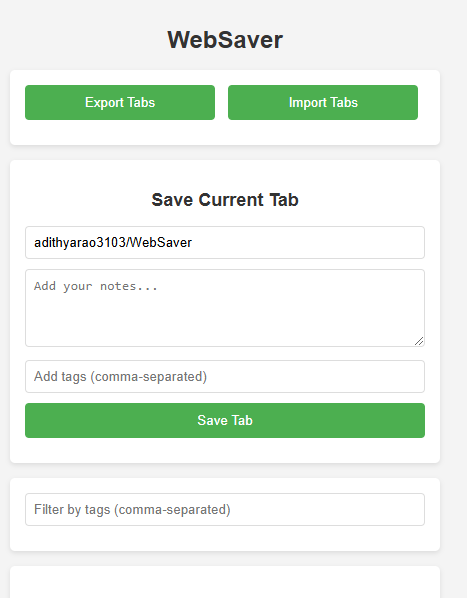
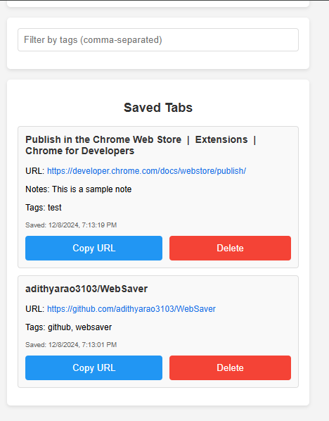

# WebSaver Chrome Extension

## Overview

WebSaver is a Chrome extension that allows you to save, tag, and organize your browser tabs with accompanying notes. It is completely offline and runs locally, and therefore does not compromise your data.

## Features

| Screenshot 1 | Screenshot 2 |
|------------|------------|
| |  |

- Save current tab with custom title
- Add notes to saved tabs
- Tag your saved tabs
- Import/Export saved tabs
- View and manage saved tabs
- Delete saved tabs

## Installation

### Manual Installation

1. Clone this repository
2. Open Chrome and navigate to `chrome://extensions/`
3. Enable "Developer mode"
4. Click "Load unpacked"
5. Select the `WebSaver` directory

## Development

### Prerequisites

- Google Chrome Browser
- Basic understanding of Chrome Extensions

### Project Structure

- `manifest.json`: Extension configuration
- `popup.html`: Main user interface
- `popup.js`: Popup functionality and tab management
- `styles.css`: Extension styling
- `background.js`: Background script for extension

## Roadmap

- [ ] Implement search functionality
- [ ] Add tab editing capabilities

## Contributing

Contributions are welcome! Please feel free to submit a Pull Request.
